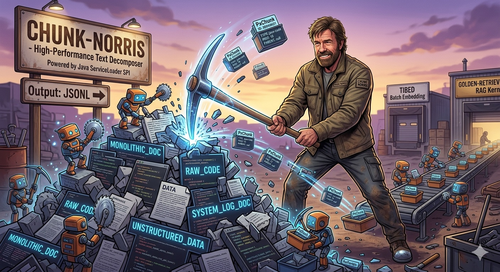
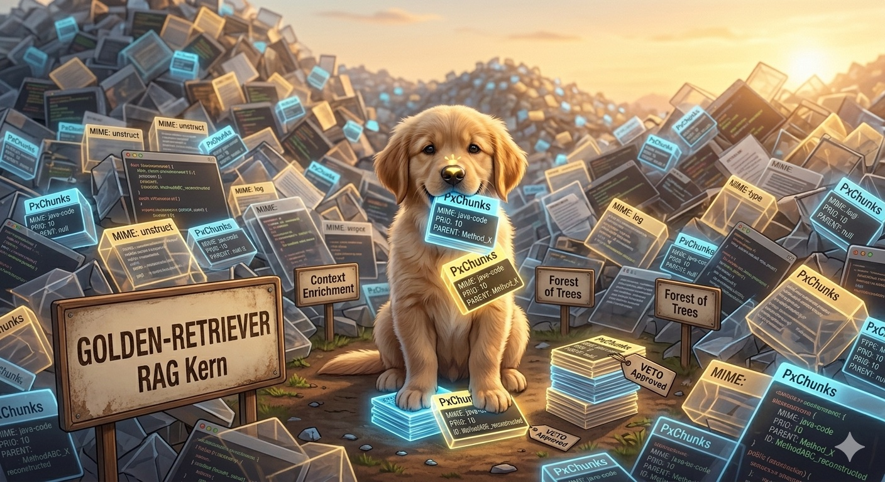

# prjxp

An AI toolset to provide an expert for a Software Project

## 🏗 Modules Overview

### 📦 Chunk-Norris

**Chunk-Norris** is a high-performance chunking framework designed to decompose text into structured `PxChunks`. It is built with extensibility at its core, allowing you to add specialized chunking logic without modifying the core library.

#### Data Output: JSONL
Chunk-Norris processes documents and outputs the resulting chunks in **JSONL (JSON Lines)** format. This ensures:
* **Streamability:** Large documents can be processed and read line-by-line.
* **Compatibility:** Each line is a valid JSON object (`PxChunk`), making it easy to pipe the output into other tools or databases.

#### Extensibility via Java SPI
Chunk-Norris leverages the classic **Java ServiceLoader mechanism**. This allows you to integrate custom chunkers by simply adding a JAR to your classpath:

1. **Implement the Broker:** Inherit from `AnnotationBasedChunkerBrokerImpl` to 
   define your custom loading logic.
2. **Annotate Methods:** Within your code, mark the actual chunking methods with the `@Chunker` annotation.
3. **Register the Service:** Add your factory class to the service 
   configuration file in `META-INF/services/de.spraener.chuno.ChunkerBroker`.
4. **Automatic Integration:** Once the JAR is present, Chunk-Norris automatically discovers and integrates your new capabilities.

#### Intelligent Selection Logic
You don't need to manually select a chunker. Chunk-Norris automatically identifies the best tool for the job:
* It scans all registered `ChunkerFactories` at runtime.
* For any given file type, it selects the Chunker that declares the **highest Priority** for that specific format.

---

### 📦 Tibed

**Tibed** is a batch-oriented embedding engine that serves as the bridge between raw chunks and searchable vectors.

* **Input:** It consumes the **JSONL** output generated by Chunk-Norris.
* **Metadata Persistence:** Tibed processes each entry as a `PxChunk`. All attributes and metadata associated with the chunks are automatically mapped and stored within **ChromaDB**.
* **Compatibility:** By preserving the structured metadata, Tibed ensures that the data remains fully compatible with the retrieval logic of **Golden-Retriever**.

### 📦 Golden-Retriever

**Golden-Retriever** serves as the core RAG (Retrieval-Augmented Generation) engine. Unlike simple vector-search tools, it implements a sophisticated enrichment and filtering pipeline to ensure high-quality context for the LLM.

#### Specialized JavaCodeRetriever
At its heart, the module features a specialized `JavaCodeRetriever` designed for technical analysis:
* **Context Enrichment:** When a `PxChunk` with the mime-type `text/x-java-code` is matched, the retriever reconstructs an abstract description of the affected class.
* **Data Synthesis:** It merges retrieved chunks with additional data from the database into a meaningful **Context Enrichment**, while intelligently deduplicating overlapping information.

#### Forest of Trees & Veto System
To handle complex queries where multiple vector hits might refer to different parts of a system, Golden-Retriever manages a **"Forest of Trees"**:
* **Tree Management:** Since multiple hits can result in several distinct logical structures (trees), the module manages them collectively as a forest.
* **Granular Enrichment:** For each individual tree, a specific Context Enrichment is generated.
* **Veto Mechanism:** To maintain high data quality, each enrichment is passed through a **Veto System**. This allows specialized filters to reject "noise" or irrelevant trees before they reach the LLM, ensuring only precise and relevant information is used for final generation.

### 📦 prjxp-common

The **prjxp-common** module provides the foundational data structures and utilities shared across the entire ecosystem. Its primary purpose is to maintain data integrity and structural relationships between chunks.

#### The PxChunk Core
The central entity is the `PxChunk`, which is much more than a simple text fragment. It is designed for structural reconstruction:
* **Logical Identity:** Chunks belonging to the same logical unit (e.g., a single long method) share the same **ID**. This allows **Golden-Retriever** to perfectly reconstruct the original source code, even if it was split across multiple entries.
* **Hierarchical Metadata:** By utilizing metadata fields like `parent`, the system can reconstruct complex tree structures from flat database hits.
* **Vector References:** Each `PxChunk` can store a `reference` (e.g., Fully Qualified Class Name and method signature). This provides the vectorization process with the necessary context regarding where the chunk logically belongs in the codebase.

#### Structural Utilities
The module includes essential utilities to handle the lifecycle of these chunks:
* **Decomposition:** Tools to split long text blocks into a sequence of `PxChunks` while maintaining their logical links.
* **Recomposition:** Logic to merge a list of `PxChunks` with the same ID back into a coherent, original text block.

---

## 🤠 Fun Fact: The Documentation Paradox

You might notice that **prjxp** has absolutely zero manual Javadoc. This is a deliberate architectural decision.

> "Chunk Norris doesn't need documentation. Chunk Norris **is** the source of it!"

**Chunk-Norris now documents itself.** By utilizing its own specialized `JavaCodeRetriever` and enrichment pipeline, the framework generates its own technical documentation. It doesn't just process code; it understands its own soul.

**Documentation is a generation task, not a manual one.**

---
_This README was generated with Gemini – based on code documented by Chunk-Norris._

---
_This README was generated with Gemini._