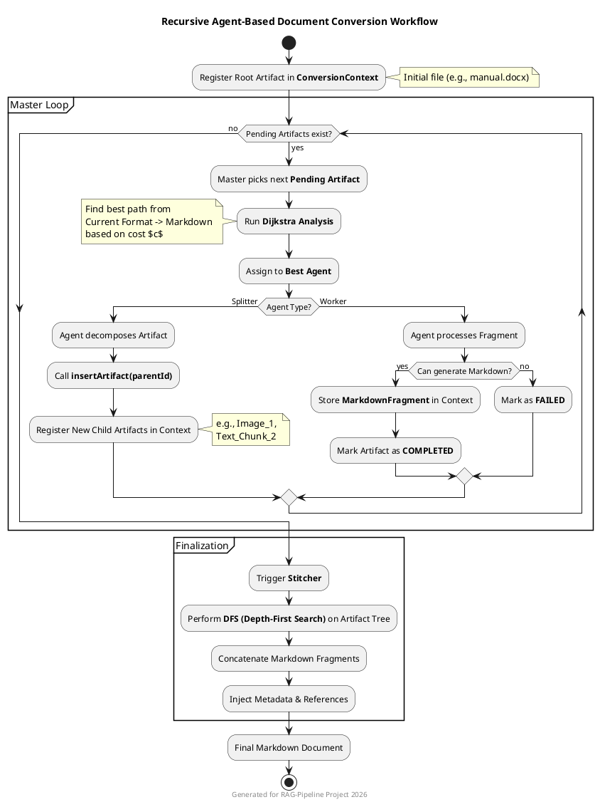

# Architectural Concept: Recursive Agent Network for Document Conversion

This system transforms unstructured legacy data (PDF, DOCX, RTF) into semantically rich Markdown to maximize the quality of a RAG (Retrieval-Augmented Generation) system.

---

## 1. Core Components

| Component | Function |
| :--- | :--- |
| **Conversion Master** | The "Navigator." Calculates the most efficient path from source to target format using **Dijkstra's Algorithm**. |
| **Conversion Agents** | Specialized micro-services. Categorized as **Splitters** (decomposing documents) or **Workers** (converting fragments). |
| **Conversion Context** | The "Blackboard." A central registry managing the artifact tree structure and processing states. |
| **Stitcher** | The "Assembler." Traverses the completed tree using **DFS (Depth-First Search)** to merge fragments into a final document. |

---

## 2. Recursive Workflow

The system operates exploratively rather than linearly:

1.  **Initialization:** The source document is registered as the root artifact in the context.
2.  **Dijkstra Routing:** The Master identifies the lowest-cost agent for the current format.
3.  **Recursive Decomposition:**
    *   A **Splitter Agent** (e.g., Apache POI) identifies the structure (text, images, tables).
    *   It generates new child artifacts via `insertArtifact(parentId)`.
    *   These new leaves trigger a new analysis cycle by the Master.
4.  **Specialized Processing:**
    *   **Text fragments** are translated directly into Markdown.
    *   **Images** are routed to Vision LLMs (Ollama/Llava).
    *   **UML diagrams** are specifically transformed into **PlantUML (@puml)**.
5.  **Finalization:** Once all leaves are converted, the Stitcher generates the final Markdown output.

---

## 3. Dynamic Cost Analysis

The Master selects agents based on a weighted cost function $c$, preventing expensive vision models from being wasted on simple text tasks.

$$c_{agent} = (S \cdot k_{format}) + L_{base}$$

*   **$S$**: Size of the artifact (e.g., KB or pixels).
*   **$k$**: Complexity factor of the target format (e.g., HTML is "cheaper" than Vision-OCR).
*   **$L$**: Base latency of the agent (e.g., LLM model cold-start/inference time).

---

## 4. RAG & Code Alignment Benefits

*   **Semantic Coherence:** DFS traversal ensures logical order is maintained, even with asynchronous and parallel processing.
*   **UML-to-Code:** Converting diagrams into PlantUML allows the RAG system to compare visual architecture directly with actual source code (Java/C++).
*   **Metadata Anchoring:** Every fragment retains a link to the original document (e.g., page, section), increasing the precision of citations in the RAG chatbot.

---

## 5. Implementation Stack

*   **Backend:** Spring Boot (using `ApplicationEventPublisher` for agent communication).
*   **LLM Orchestration:** LangChain4j.
*   **Local AI:** Ollama (Models: `gemma2` for text, `llava` for vision).
*   **Parsing:** Apache Tika & Apache POI.
*   **Vector Storage:** Direct integration of the Stitcher into a Vector DB (e.g., Qdrant or Weaviate).