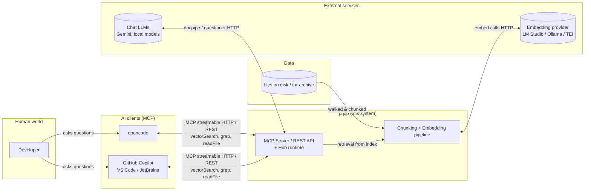
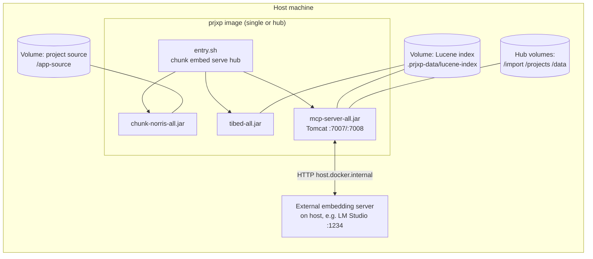

# 3. Context and Scope

## 3.1 Business (Functional) Context

prjxp sits between a **software project** and the **AI coding assistants** that work on it.
It is a *knowledge provider*: it ingests the project's source code and documents, and serves
retrieved knowledge to LLM clients.

**External functional interfaces:**

| Interface | Direction | Description |
|---|---|---|
| MCP tools (`/mcp`, streamable HTTP) | AI client → prjxp | `vectorSearch` (semantic discovery), `grep` (exact full-text), `readFile` / `readBySignature` (complete source views), `listProjects`. |
| REST API (`/prjxp/tools/*`, `/prjxp/projects*`) | humans/scripts → prjxp | Same capabilities as plain HTTP (ping, context, vectorSearch, grep, byIndex, meta-search-params) plus hub project lifecycle (list/delete/reindex). |
| Web UI (`/`) | humans → prjxp | Hub project list with lifecycle status (static `index.html` + vanilla JS). |
| Embedding API (OpenAI-compatible `/v1/embeddings`, Ollama) | prjxp → external | Batched embedding of chunk content. |
| Chat LLM API (OpenAI-compatible, Gemini, …) | prjxp → external | Used by docpipe and the golden-retriever questioner. |
| File system / tar archives | external → prjxp | The indexed project: mounted directory (single mode) or dropped tar / live marker dir (hub). |

## 3.2 Technical Context

**External technical interfaces:**

| Interface | Technology | Notes |
|---|---|---|
| MCP endpoint `POST /mcp` | Streamable HTTP (Spring AI MCP server WebMVC, protocol `streamable`, name `prjxp-mcp` v1.0.0) | CORS restricted to LAN/localhost patterns; a compatibility filter rewrites legacy protocol version `2025-06-18` requests. |
| REST endpoints | Spring MVC + springdoc OpenAPI (Swagger UI) | `/prjxp/tools/ping|context|vectorSearch|grep|byIndex|meta-search-params`, `/prjxp/projects[/{name}[/reindex]]`. |
| Embedding provider | HTTP (OpenAI-compatible or Ollama) | Configured via `prjxp.embedding.*`; in Docker typically `http://host.docker.internal:1234/v1`. |
| File system | Bind mounts / named volumes | Project source, Lucene index directory, hub import/projects/data areas. |
| JSONL files | Plain files / stdout | `px-chunks.jsonl` (chunk output) and optional encrypted transfer files. |

**Mapping functional → technical interfaces:**

| Functional interface | Technical realization |
|---|---|
| "Ask the project expert" | MCP `vectorSearch` → Lucene KNN search + golden-retriever enrichment |
| "Find this exact string" | MCP `grep` → Lucene full-text (`TermQuery`) over chunk content + metadata filters |
| "Show me the whole file / method" | MCP `readFile`/`readBySignature` → index reconstruction via per-language `FileViewProvider`s |
| "Index my project" | chunk-norris (walk + vetoes + chunkers → JSONL) then tibed (embed → Lucene) |
| "Add a project to the hub" | tar drop into `/import` or `prjxp.yaml` marker in a live dir → in-process pipeline |

## 3.3 Scope

### In scope

- **Code languages:** Java (full: methods, javadoc, class frames, symbol metadata),
  TypeScript, Visual Basic (code sections + file views; no `symbol_*` metadata yet).
- **Document formats:** Markdown, plain text, PDF (chapter chunking + Tika conversion),
  DOCX/DOC, HTML, RTF — via the doc-conversion router (agents per format).
- **Interfaces:** MCP streamable HTTP, REST API, CLI (`chunk`/`embed` modes), hub web UI.
- **Deployment:** single-project container (one index per project) and multi-project hub
  (shared, project-stamped Lucene index).
- **Multi-project addressing:** every chunk is stamped with its `project`; all searches are
  project-scoped.

### Out of scope

- General-purpose vector database or search engine for arbitrary (non-project) data.
- IDE plugin / editor integration — prjxp integrates *through* existing MCP clients.
- Binary formats and images as searchable content (images are vetoed by default; an
  image→Markdown conversion agent exists for document pipelines).
- Model training, fine-tuning or local inference — prjxp only *consumes* model APIs.
- Source control integration (no git-aware incremental indexing; re-indexing is explicit).
