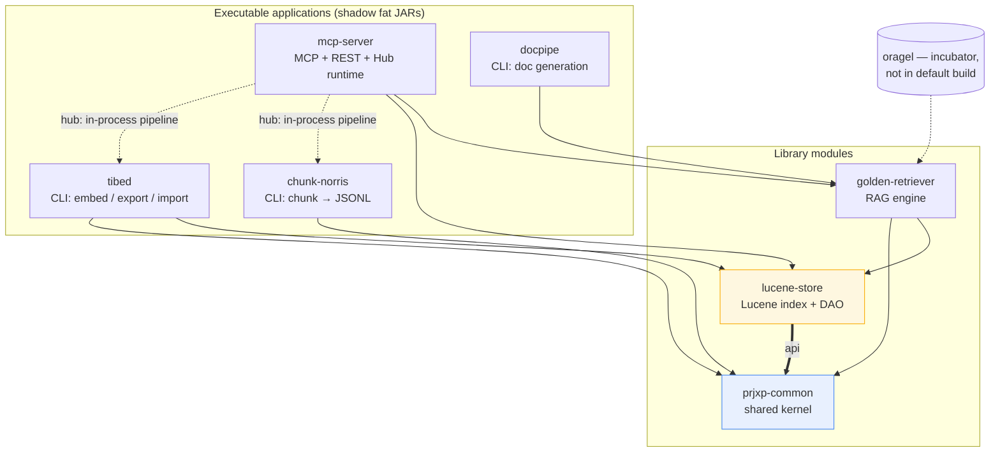
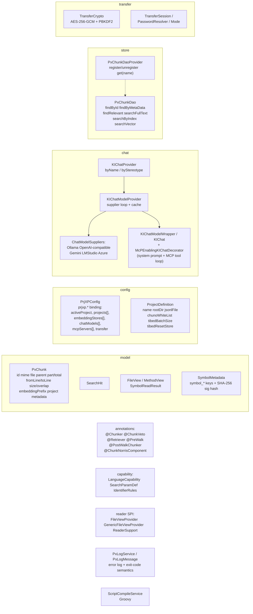
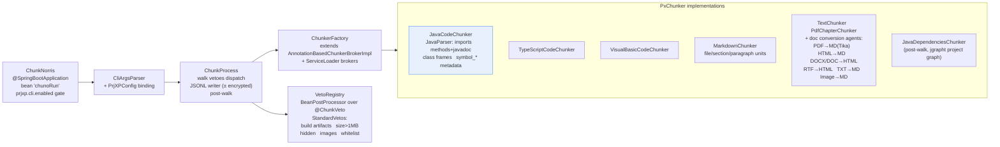
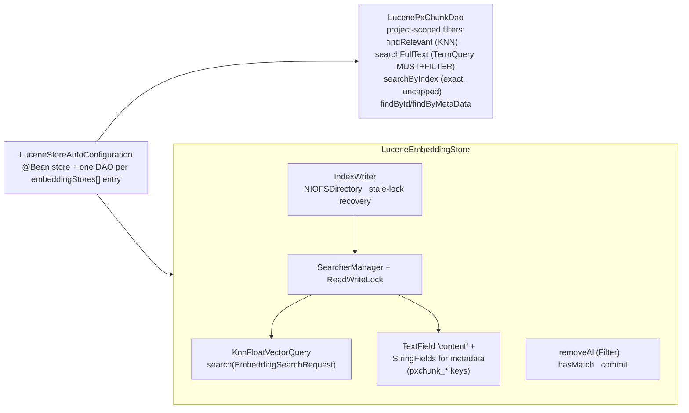
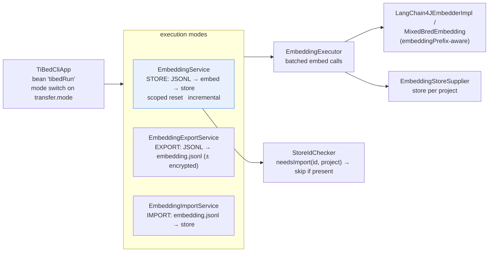
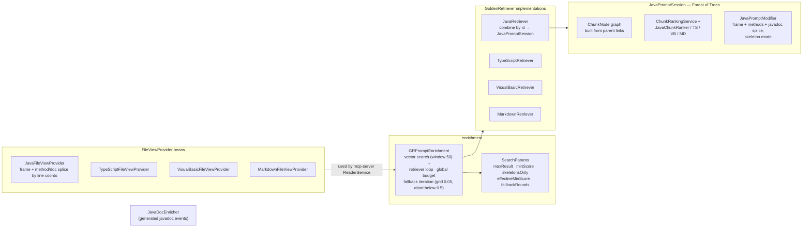
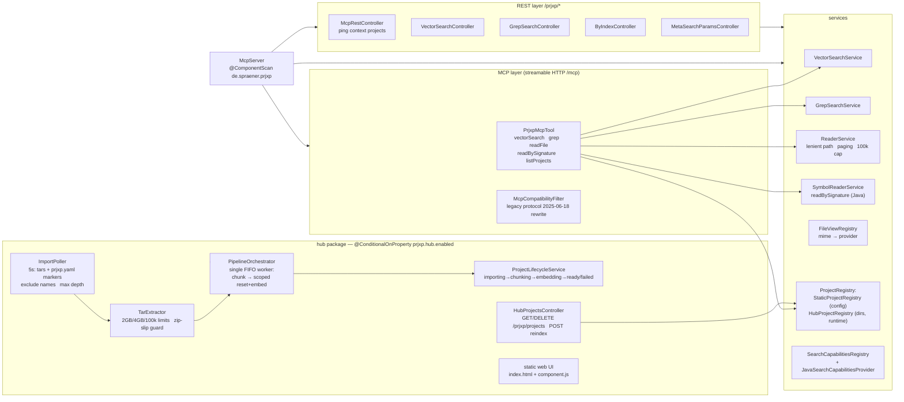
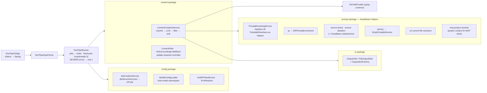

# 5. Building Block View (Static)

## 5.1 Whitebox: Whole System (Level 0)



**Rationale:** strict layering — every module depends only on `prjxp-common` (the shared
kernel) and, where retrieval/storage is needed, on `lucene-store`. Only the *applications*
compose libraries; `mcp-server` is the only module that sees all of them (it must, because
hub mode runs the whole pipeline in one process). `lucene-store` exposes `prjxp-common`
as **api** (its DAO types appear in its public signatures).

### Contained building blocks (Level 1 black boxes)

| Black box | Purpose / Responsibility | Interface(s) | Quality characteristics |
|---|---|---|---|
| **prjxp-common** (`de.spraener.prjxp.common`) | Shared kernel: `PxChunk` model + metadata keys, config binding (`PrjXPConfig`, `ProjectDefinition`, store/chat/MCP references), chat abstraction (`KIChat`, `KIChatProvider` + per-server suppliers: Ollama, OpenAI-compatible, Gemini, LM Studio, Azure), **MCP client infrastructure** (`McpClientManager` with stdio + **Streamable HTTP transport**, `McPEnablingKIChatDecorator` for tool-enabled LLMs with system prompts), store abstractions (`PxChunkDao`, `PxChunkDaoProvider`), transfer crypto (AES-256-GCM/PBKDF2), annotations (`@Chunker`, `@ChunkVeto`, `@Retriever`, `@PreWalk`, `@PostWalkChunker`, `@ChunkNorrisComponent`), capability registry types, reader SPI (`FileViewProvider`), error log service. | Java API (no own process) | Dependency of all modules; keeps the `PxChunk` contract in exactly one place. LangChain4j MCP **1.21.0-beta31** for `StreamableHttpMcpTransport`. |
| **chunk-norris** (`de.spraener.prjxp.chuno`) | CLI chunking framework: walks a project tree, applies vetoes, selects & runs chunkers per file (SPI), writes JSONL (optionally encrypted). | `ChunkNorris` main; `ChunkerBroker` SPI (`META-INF/services/de.spraener.chuno.ChunkerBroker`); `PxChunker`; `@Chunker`/`@PostWalkChunker` discovery; `VetoRegistry`. | Parallel file processing; per-file fault isolation (parse errors → empty stream, run continues). |
| **lucene-store** (`de.spraener.prjxp.lucene`) | File-based vector + full-text index: `LuceneEmbeddingStore` (LangChain4j `EmbeddingStore`, KNN search, filter-based delete), `LucenePxChunkDao` (project-scoped DAO: vector/full-text/index search, find-by-id/metadata), Spring auto-configuration. | `EmbeddingStore<TextSegment>`, `PxChunkDao`; `LuceneStoreAutoConfiguration`. | Single-writer index; stale-lock recovery; read/write locking. |
| **tibed** (`de.spraener.prjxp.tibed`) | Batch embedding engine: reads JSONL in batches, embeds via LangChain4j `EmbeddingModel`, writes to the store. Modes: **STORE** (default), **EXPORT** (chunks → `embedding.jsonl` with vectors, encrypted transfer), **IMPORT** (`embedding.jsonl` → store). | `TiBedCliApp` main; `EmbeddingService.executeForProject()` (in-process use by hub). | Incremental embed (`StoreIdChecker` skips existing ids); project-scoped reset; batch size per project. |
| **golden-retriever** (`de.spraener.prjxp.gldrtrvr`) | RAG engine: `GoldenRetriever` implementations per language (Java, TypeScript, Visual Basic, Markdown), chunk ranking services/rankers, prompt sessions with **Forest of Trees** reconstruction, `GRPromptEnrichment` (search + fallback iteration + budgets), per-language `FileViewProvider`s, Javadoc enricher. | `GoldenRetriever` (buildPromptForFindings / retrieveSearchHits), `GRPromptEnrichment.enrich(...)`, `FileViewProvider` beans. | Deterministic context construction; global content budget across retrievers. |
| **mcp-server** (`de.spraener.prjxp.mcp`) | Runtime: Spring AI MCP server (streamable) with tools `vectorSearch`, `grep`, `readFile`, `readBySignature`, `listProjects`; REST API + OpenAPI; project registries (static / hub); search capability registry; reader services; **hub package** (import poller, tar extractor with security limits, pipeline orchestrator, lifecycle service, projects REST + web UI). | `McpServer` main; MCP endpoint `/mcp`; REST `/prjxp/*`; web UI `/`. | Strictest coverage ratchet (0.80); compatibility filter for legacy MCP protocol versions. |
| **docpipe** (`de.spraener.prjxp.docpipe`) | Documentation pipeline: reads jobs from `.dp/documents.json`, resolves Handlebars prompt templates via pluggable resolvers (`gr` → golden-retriever enrichment, `source-dump`, `source-skeleton`, `groovy` scripts, `url`, `current-file`, **`mcp-project`** → project context for MCP tool usage), calls LLMs by stereotype, writes output files. The LLM can use **MCP tools over HTTP** (via `McPEnablingKIChatDecorator`) to query the prjxp MCP server (`vectorSearch`, `grep`, `readFile`, `readBySignature`) for embedded project information during content generation. | `DocPipeCliApp` main; `.dp/` job configuration directory. | Parallel task execution (fixed pool, `prjxp.docpipe.maxthreads`); misconfigured jobs degrade to empty job instead of aborting; MCP tool loop runs transparently inside `String chat(String)`. |
| **oragel** (`de.spraener.prjxp.oragel`, *incubator*) | Experimental interactive CLI: prompt sources + enrichment events, console log listener. Scans `gldrtrvr` beans. | `OragelCliApp` main. | **Not included** in the default `settings.gradle`; experimental, no stability promise. |

> Placeholder: `prjxp-launcher` is listed in `settings.gradle` but contains no sources yet
> (reserved for a future unified launcher).

## 5.2 Level 2 — Whitebox per Module

### 5.2.1 prjxp-common



Key interfaces:

- `PxChunkDao` — the storage contract used by all retrieval code. Default methods
  (`searchFullText`, `searchByIndex`, `searchVector`) throw `UnsupportedOperationException`
  so non-Lucene stores degrade gracefully.
- `PxChunkDaoProvider.get(projectName)` — `"default"` resolves to the store reference with
  `isDefault=true`; supports runtime `register`/`unregisterByProject` (hub).
- `KIChatProvider.getByStereotype(...)` — docpipe selects LLMs by stereotype (e.g.
  `javadoc`); the MCP client manager decorates chats with external MCP tools via
  `McPEnablingKIChatDecorator` (supports **stdio** and **Streamable HTTP** transports,
  injects system prompt with `defaultProject` context).

### 5.2.2 chunk-norris



- **Selection logic:** `ChunkerFactory` aggregates its own annotation-discovered chunkers
  plus all `ServiceLoader<ChunkerBroker>` registrations; for a file, every matching
  chunker (`PxFileType` suffix match via `@Chunker(fileTypes=…)`) runs.
- **Java unit structure** (mime `text/x-java-code`, section key `java_code_section`):

  | Unit | id | parent | content |
  |---|---|---|---|
  | imports | `FQN.imports` | `FQN` | import block (also inside frame) |
  | methodDoc | `FQN.sig.javadoc` | method id | javadoc text |
  | method | `FQN.sig` (sig = declaration w/o params) | `FQN` | annotations + real source lines |
  | classFrame | `FQN` (root) | — | synthesized skeleton: package + imports + javadoc + header + fields + signature lines + `}` |

  Long units are split by `ContentSplitter` (`prjxp.java.chunksize:1000`,
  `chunkoverlap:100`) into parts sharing the unit id. Method chunks carry an
  `embeddingPrefix` (`package ClassName`) for vector disambiguation and `symbol_*`
  metadata (FQN, name, type, container FQN, SHA-256 signature hash) for `readBySignature`.
- **Document pipeline:** `DocConversionRouter` + `ConversionRoutesConfig` route formats to
  conversion agents (accuracy/cost-estimated routes); results feed the Markdown/Text/PDF
  chunkers. `MetaInfReader` handles META-INF resources.

### 5.2.3 lucene-store



- Documents store: `content` (analyzed), all `pxchunk_*` metadata as string fields,
  the KNN vector (`KnnFloatVectorField`, dimension validated on write).
- `LucenePxChunkDao` scopes **every** query with `pxchunk_project = <project>` — this is
  the multi-project separation mechanism.

### 5.2.4 tibed



- `EmbeddingService.executeForProject(pd, store)` is the in-process entry point used by
  the hub; it stamps `project` on every chunk **before** the incremental check.

### 5.2.5 golden-retriever



- `GRPromptEnrichment.enrich(project, prompt, …)` is the single entry point used by MCP
  `vectorSearch`, REST `/context` and docpipe's `gr` resolver.

### 5.2.6 mcp-server



- `McpServer` scans the **whole** `de.spraener.prjxp` root — this is how all module beans
  (chunkers, retrievers, readers, the Lucene store) become visible in one process.
- Bean-name discipline: CLI runners are named `chunoRun`/`tibedRun` and gated by
  `prjxp.cli.enabled` (hub sets it to `false`).

### 5.2.7 docpipe



## 5.3 Level 3 — Selected Deep Dives

### 5.3.1 `PxChunk` (prjxp-common) — the universal data contract

```java
class PxChunk {
    String id;              // logical identity — shared by all parts of a split unit
    String mimeType;        // text/x-java-code, text/x-typescript-code, …
    String file;            // rootDir-relative path with leading slash (/src/Foo.java)
    String parent;          // id of the containing unit (tree edge)
    int part, total;        // split position / number of parts
    String fromLine, toLine;// 0-based line coordinates in the original file
    int size, overlap;      // content length / splitter overlap used
    String embeddingPrefix; // prepended to embedded text (e.g. "pkg ClassName")
    String project;         // owning project — stamped at embed time (multi-project)
    Map<String,String> metadata;  // pxchunk_* system keys + typed unit roles (java_code_section, symbol_*)
    String content;         // the actual text fragment
}
```

Static helpers: `create(Consumer…)` (fluent builder), `fromContentAndMap` /
`metadataAsMap` (flat metadata ↔ object mapping for JSONL/Lucene), `combine(List)`
(sort by part, overlap-aware unsplit → original unit).

### 5.3.2 `LuceneEmbeddingStore.search` — the retrieval core path

1. Embed question (or receive query embedding) → `KnnFloatVectorQuery` on the vector field.
2. Optional metadata filter (LangChain4j `Filter` → Lucene `BooleanQuery`, via
   `LuceneFilterConverter`).
3. `TopDocs` → stored fields → `TextSegment`s with metadata → `EmbeddingSearchResult`.
4. Concurrency: lazy open under write lock; searches via `SearcherManager` (shared,
   released after use); stale zero-byte `write.lock` is deleted and retried once.

### 5.3.3 `GRPromptEnrichment` — the fallback loop

```
do:
    hits = dao.searchVector(prompt, window=max(20,50)) filtered by minScore
    context = Σ over retrievers: buildPromptForFindings(hits)   // global budget 60k
    valid = contextValidators(context)                          // veto system
while !valid:
    if maxResult < 16: maxResult += 2
    else: minScore = floor((minScore - ε) / 0.05) * 0.05       // grid snap
    if minScore < 0.5: abort → "Es konnte kein valider Kontext erstellt werden"
```

The effective threshold + fallback round count is reported to the caller (transparency).

### 5.3.4 Hub pipeline worker (mcp-server)

Single daemon thread `prjxp-pipeline` (FIFO). Per project:
`register (IMPORTING) → ChunkProcess.executeForProject → scoped reset + EmbeddingService.executeForProject → READY`
(or `FAILED`). Enqueue is idempotent per name; a re-import *supersedes* the in-flight run.
On startup, projects whose chunks are already in the index go straight to `READY` (self-heal).
