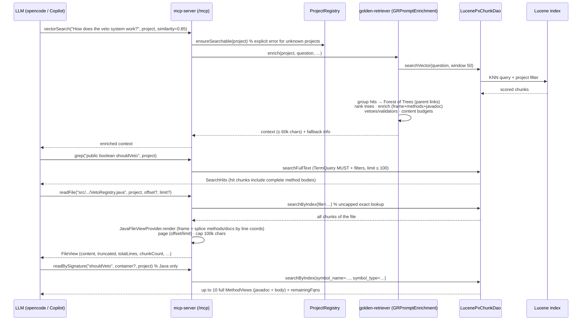
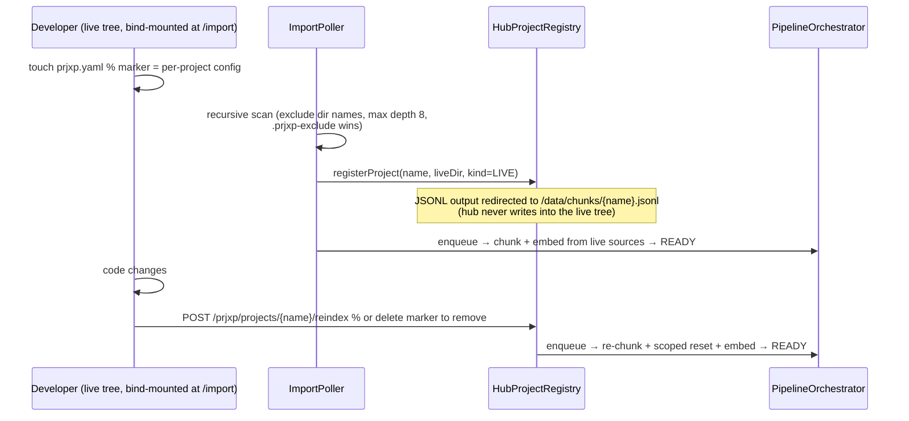
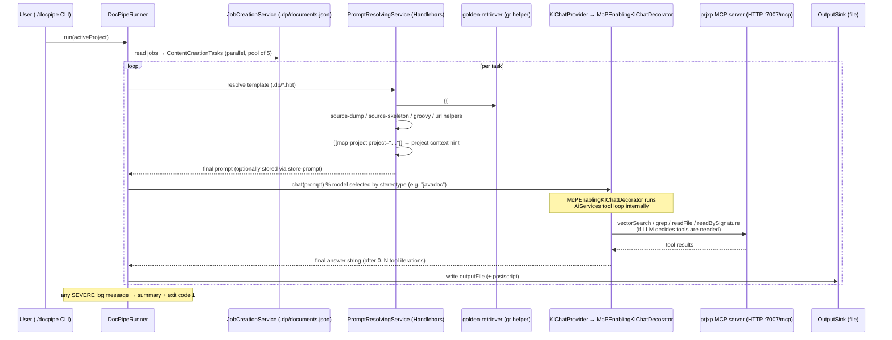

# 6. Runtime View

## 6.1 Scenario: Single-Project Pipeline (chunk → embed → serve)

The canonical flow, driven by the `./prjxp <project> mcp` control script (Docker) or the
individual CLI apps.

```mermaid
sequenceDiagram
    participant U as User (./prjxp script)
    participant CN as chunk-norris
    participant FS as File system (project dir)
    participant TB as tibed
    participant EMB as Embedding provider (HTTP)
    participant IDX as Lucene index (.prjxp-data/lucene-index)
    participant MS as mcp-server

    U->>CN: run (mode chunk)
    CN->>FS: walk project tree
    loop per file
        CN->>CN: vetoes (build/size/hidden/image/whitelist)
        CN->>CN: select chunker(s) via SPI, chunk (parallel)
    end
    CN->>FS: write px-chunks.jsonl (± encrypted)

    U->>TB: run (mode embed, STORE)
    TB->>FS: read px-chunks.jsonl in batches (tibedBatchSize)
    opt tibedResetStore=true
        TB->>IDX: removeAll(project = X)   % scoped reset (shared index)
    end
    loop per batch
        TB->>TB: skip chunks already embedded (StoreIdChecker)
        TB->>EMB: embed(batch)  % HTTP, OpenAI-compatible/Ollama
        EMB-->>TB: vectors
        TB->>IDX: addAll(vectors + pxchunk_* metadata, project stamp)
    end

    U->>MS: run (mode serve) on :7007
    Note over MS: LuceneStoreAutoConfiguration wires store + DAOs;<br/>MCP endpoint /mcp live
```

**Particularities:** stages are decoupled by the JSONL file — each can be re-run
independently; the control script skips chunking if `px-chunks.jsonl` exists and skips
embedding if `.prjxp-data` has content (use `clean` to force a full re-index).

## 6.2 Scenario: MCP Query — the Three-Level Search Ladder



**Particularities:** `vectorSearch` returns *skeletons* for non-hit methods by design —
the tool description steers the LLM to `grep`/`readBySignature` for full bodies and
`readFile` for whole files. All levels share the unified `SearchHit` format.

## 6.3 Scenario: Hub — Tar Import (one container, many projects)

```mermaid
sequenceDiagram
    participant OP as Operator
    participant IMP as /import (bind mount)
    participant POLL as ImportPoller (5s)
    participant TAR as TarExtractor
    participant REG as HubProjectRegistry
    participant ORCH as PipelineOrchestrator (FIFO worker)
    participant CN as ChunkProcess (in-process)
    participant TB as EmbeddingService (in-process)
    participant IDX as shared Lucene index (/data)

    OP->>IMP: drop my-project.tar
    POLL->>IMP: poll → new archive
    POLL->>TAR: extract (limits 2GB/4GB/100k, zip-slip/symlink guard)
    TAR-->>REG: registerProject(name, /projects/my-project)  % status IMPORTING
    REG->>REG: parse prjxp.yaml (or defaults) · register LucenePxChunkDao
    POLL->>ORCH: onImported → enqueue (supersedes in-flight run of same name)
    ORCH->>CN: executeForProject(def)            % status CHUNKING
    CN-->>ORCH: JSONL (hub-managed area)
    ORCH->>TB: executeForProject(def, sharedStore)  % status EMBEDDING
    TB->>IDX: scoped reset (project) + embed batches
    ORCH-->>REG: status READY   % now listed by listProjects / web UI / MCP
    Note over ORCH: failure → status FAILED (error message);<br/>deregistration mid-run wipes what was written
```

**Particularities:** the Lucene index allows one writer → all projects' pipelines run on
a **single FIFO worker** (serialized, never parallel). Re-importing an existing name
replaces it (old data wiped first). Failed archives are renamed `*.tar.failed` (no retry).

## 6.4 Scenario: Hub — Live Project via Marker File



## 6.5 Scenario: External Embedding (offline transfer, machine A → B)

For projects that must not leave the premises unencrypted, or where embedding hardware
lives elsewhere:

```mermaid
sequenceDiagram
    participant A as Machine A (chunk-norris, tibed EXPORT)
    participant TR as transfer file (embedding.jsonl)
    participant B as Machine B (tibed IMPORT, GPU/TEI)

    A->>A: chunk → px-chunks.jsonl
    A->>TR: EXPORT mode: read chunks, embed? no —<br/>write records with content (AES-256-GCM if password resolvable)
    Note over TR: password from PRJXP_TRANSFER_PASSWORD (.env);<br/>AUTO mode: encrypt iff resolvable; explicit mode without password<br/>generates one and prints it (twice: start + end of run)
    TR->>B: manual transfer (USB, SFTP, …)
    B->>B: IMPORT mode: decrypt → embed via local model → write embedding.jsonl (± encrypted)
    B->>A: return transfer
    A->>A: IMPORT into Lucene store (vectors pre-computed)
```

## 6.6 Scenario: DocPipe — Documentation Generation



**Particularities:** The `McPEnablingKIChatDecorator` wraps the base `KIChat` in a
LangChain4j `AiServices` agent with MCP tools. The LLM decides autonomously whether to
use tools (based on the system prompt and user question). The `mcp-project` Handlebars
helper injects project context into the prompt so the LLM knows which embedded project to
query. MCP servers are configured globally in `PrjXPConfig.mcpServers[]` with `type: "http"`,
`url`, and optional `defaultProject`. The tool loop is transparent to docpipe — the outer
contract remains `String chat(String)`.

## 6.7 Scenario: Hub Startup Self-Heal

On `hub` mode startup, the registry re-discovers all project directories (extracted
snapshots + live markers) and for each: if its chunks are already present in the shared
index (`hasMatch(project=…)`), status goes straight to `READY`; otherwise the full
pipeline is enqueued. This makes hub restarts non-destructive and idempotent.
