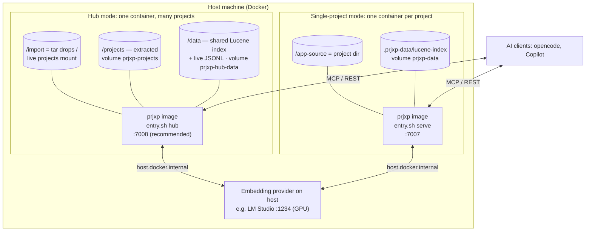
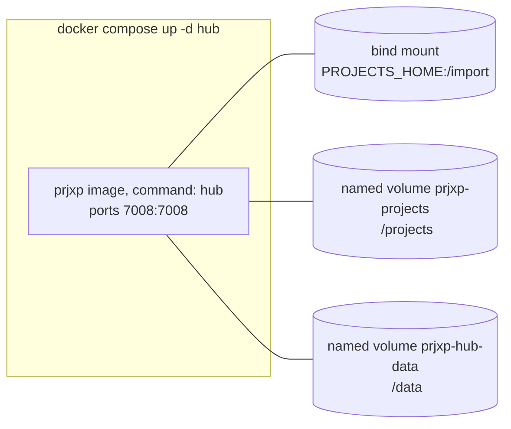

# 7. Deployment View

## 7.1 Infrastructure Level 1 — Host with Docker

**Single image, four entry modes** (`entry.sh`): `chunk`, `embed`, `serve`, `hub`.
The image contains the three fat JARs (`chunk-norris-all.jar`, `tibed-all.jar`,
`mcp-server-all.jar`) plus the entry script; `application.yaml.docker` is baked in as
fallback configuration (a project-provided `application.yml/.yaml` under `/app-source`
takes precedence via `SPRING_CONFIG_LOCATION`).

## 7.2 Container Anatomy & Assignment of Building Blocks

| Element | Single-project mode | Hub mode |
|---|---|---|
| `chunk-norris-all.jar` | run as separate process (`entry.sh chunk`) | **in-process** bean of mcp-server (CLI runner off) |
| `tibed-all.jar` | separate process (`entry.sh embed`) | **in-process** bean of mcp-server (CLI runner off) |
| `mcp-server-all.jar` | serves MCP/REST on `SERVER_PORT` (7007) | same + hub beans (`prjxp.hub.enabled=true`) on 7008 (recommended) |
| Embedding server | optional in-container TEI (`SKIP_EMBEDDING_SERVER=false`) or external on host (compose default: `true` → LM Studio) | same |
| Project source | `/app-source` (bind mount of the project dir) | `/import` (tars / live dirs) + `/projects` (extracted snapshots) |
| Lucene index | `.prjxp-data/lucene-index` under `/app-source` (volume) | shared: `/data/lucene-index` (named volume), project-stamped chunks |
| JSONL artifacts | `px-chunks.jsonl` in the project dir | hub-managed: `/data/chunks/<name>.jsonl` (never into live trees) |

**JVM tuning:** `JAVA_OPTS="-XX:+UseG1GC -XX:MaxRAMPercentage=75.0 --add-modules jdk.incubator.vector"`
(vector incubator module for Lucene KNN performance).

## 7.3 Configuration via Environment Variables

| Variable | Default | Purpose |
|---|---|---|
| `LUCENE_INDEX_PATH` | `.prjxp-data/lucene-index` (single) / `/data/lucene-index` (hub) | Index directory |
| `LUCENE_VECTOR_DIMENSION` | `1024` | Must match the embedding model (mxbai-embed-large-v1) |
| `SERVER_PORT` | `7007` (hub: `7008` recommended) | HTTP port for MCP/REST/UI |
| `EMBEDDING_API_BASE_URL` / `PRJXP_EMBEDDING_API_BASE_URL` | `http://host.docker.internal:1234/v1` | OpenAI-compatible embedding endpoint |
| `PRJXP_EMBEDDING_MODEL_NAME` / `EMBEDDING_API_KEY` | `mxbai-embed-large-v1` / — | Model + key for the embedding endpoint |
| `SKIP_EMBEDDING_SERVER` | — (`false`) | Skip starting the in-container TEI server |
| `PRJXP_HUB_IMPORT_DIR` / `PRJXP_HUB_PROJECTS_ROOT` | `/import` / `/projects` | Hub directories |
| `PRJXP_HUB_SCAN_EXCLUDE_DIR_NAMES` | `.git,.svn,.hg,node_modules` | Dir names the live scan never enters (add `branches,tags,…`) |
| `PRJXP_HUB_SCAN_MAX_DEPTH` | `8` | Recursion cap below `/import` (safety net for broad mounts) |
| `PRJXP_TRANSFER_PASSWORD` | — | Password for encrypted JSONL transfer (AES-256-GCM) |
| `GEMINI_API_KEY` etc. | — (CI secrets / `.env`) | Chat model keys for docpipe/questioner |

> **Tip (broad mounts):** mount `./import` as narrowly as possible. A whole "projects
> drive" forces every 5s poll to recursively walk all sibling repos; use the exclude/depth
> settings or `.prjxp-exclude` marker files as mitigations.

## 7.4 Deployment Topology — Hub (docker-compose)

## 7.5 Local Development (no Docker)

- **Run:** `./gradlew :chunk-norris:run`, `:tibed:run`, `:mcp-server:run`,
  `:docpipe:run` (each module is a Gradle `application`).
- **Config:** per-module `src/main/resources/application.yaml` (dev defaults, e.g. Ollama
  on the LAN) + root `application.yaml` + `.env` (dotenv-java loads it into system
  properties before Spring starts).
- **Test:** `./gradlew build` (compiles + tests + JaCoCo verification against ratchets);
  single module: `./gradlew :<module>:test`.
- **Fat JAR:** `./gradlew :chunk-norris:shadowJar` etc. (see [02](02_architecture_constraints.md) § 2.4
  for the Spring metadata merge requirements).

## 7.6 CI/CD (GitHub Actions)

- `gradle-build.yml`: on push/PR to main — JDK 21 Temurin, `./gradlew build`
  (with `GEMINI_API_KEY` secret for docpipe tests); a release job runs on tags.
- Docker images are built locally (`./prjxp rebuild` / `docker compose build`) — no
  registry publishing in the current setup.
