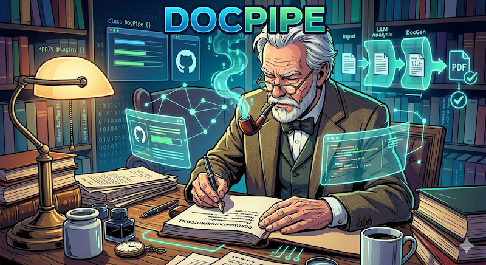

# Doc|Pipe

Doc|Pipe is a powerful CLI tool designed to automate the generation of documentation and content using Large Language Models (LLMs). It scans your project for configuration files, resolves prompt templates, and pipes the output directly into your project files.

By using a "Documentation as Code" approach, Doc|Pipe ensures your documentation stays in sync with your source code through intelligent change detection.

## How it Works

Doc|Pipe operates by scanning your project directory for special `.dp` folders. These folders contain the instructions on what to generate and which AI models to use.

```text
[ Your Project ]
├── src/
├── .env (API Keys)
└── .dp/
    ├── models.json         <-- Define your AI models
    ├── documents.json      <-- Define what to generate
    └── prompts/
        └── readme-gen.hbs  <-- Handlebars templates
```

### The Workflow
1. **Scan**: Doc|Pipe looks for directories containing a `.dp` folder.
2. **Resolve**: It reads `documents.json` to see what needs to be created.
3. **Prompt**: It compiles Handlebars templates, potentially injecting source code or external data.
4. **Check**: It compares the prompt hash with `content-hashes.properties`. If nothing changed, it skips the task.
5. **Generate**: It sends the prompt to the configured LLM (Ollama, Gemini, OpenAI, etc.).
6. **Write**: The result is saved to the specified output file.

## Configuration

### 1. The `.dp/models.json`
This file defines the AI engines available for your tasks. You categorize them by `stereotype`.

```json
[
  {
    "stereotype": "fast-coder",
    "serverType": "ollama",
    "modelName": "codellama",
    "modelProviderURL": "http://localhost:11434",
    "temperature": 0.2
  },
  {
    "stereotype": "high-quality",
    "serverType": "gemini",
    "modelName": "gemini-1.5-pro",
    "timeOutSeconds": 120
  }
]
```

**Supported Server Types:**
* `ollama`: Local LLMs.
* `gemini`: Google's Gemini API.
* `openapi` / `lm.studio`: OpenAI-compatible endpoints.

### 2. The `.dp/documents.json`
This file defines the actual generation tasks.

```json
[
  {
    "outputFile": "README.md",
    "stereotype": "high-quality",
    "prompt": "prompts/readme-gen.hbs",
    "ps": "\n\n> Generated by AI"
  }
]
```

### 3. Environment Variables (`.env`)
For cloud-based providers, place your API keys in a `.env` file in the root directory:

```env
CHAT_GEMINI_APIKEY=your_google_api_key
CHAT_OPENAPI_API_KEY=your_openai_key
```

## Prompt Templating

Doc|Pipe uses **Handlebars** for prompts. This allows you to dynamically include project content.

### Special Helpers

*   **`{{java-src-dump "path"}}`**: Scans the specified directory for `.java` files and dumps their content into the prompt wrapped in markdown code blocks.
*   **`{{URL "url"}}`**: Fetches content from a URL or local file path.

**Example Template (`readme-gen.hbs`):**
```handlebars
Create a README for the following Java project.
Explain the main logic found in these files:

{{java-src-dump "../src/main/java"}}

Focus on the architecture and usage.
```

## Usage

Run the application via the command line. By default, it works on the current directory.

```bash
# Run in current directory
java -jar docpipe.jar

# Run on a specific project path
java -jar docpipe.jar --root /path/to/my/project
```

### Change Detection
Doc|Pipe is efficient. It calculates a SHA-256 hash of your resolved prompt. If you run the tool again and the prompt (including any injected source code) hasn't changed, it will skip the LLM call to save time and API costs.

## Architecture Overview

```text
+------------+       +------------------+       +---------------+
| .dp Config | ----> | Prompt Resolver  | ----> |  LLM Service  |
+------------+       | (Handlebars)     |       | (Gemini/Ollama)|
                     +--------+---------+       +-------+-------+
                              |                         |
                              v                         |
                     +------------------+               |
                     | Hash Controller  |               |
                     | (Skip if same)   |               |
                     +--------+---------+               |
                              |                         |
                              v                         v
                     +----------------------------------+
                     |          Output File             |
                     +----------------------------------+
```

---
**Fun Fact:** Doc|Pipe is self-documenting! It generates its own [Architecture Assessment](doc/ArchitectureAssessment.md) using its internal pipeline.

_This document was generated with Doc|Pipe and gemini-3-flash-preview_

