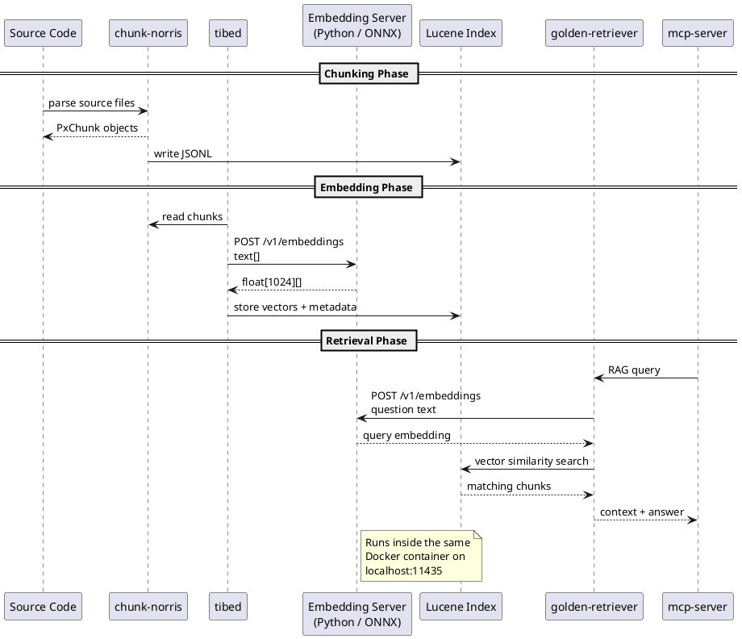

# prjxp — Build & Docker Operation Guide

## Overview

prjxp is a RAG (Retrieval-Augmented Generation) system for code bases. It chunks source code, creates embeddings, and stores them in a Lucene index — all within a single Docker image with **no external dependencies** (no ChromaDB, no Ollama).

### Architecture Inside the Docker Container

```plantuml
@startuml
skinparam componentStyle rectangle
skinparam backgroundcolor white
skinparam arrowcolor #4682B4

package "Docker Container" {
  package "Embedding Server (Python)" #E8F5E9 {
    [FastAPI + uvicorn] as fastapi
    [ONNX Runtime] as onnx
    [BertTokenizerFast] as tokenizer

    fastapi --> onnx : inference
    fastapi --> tokenizer : tokenize
  }

  package "Java Application (Spring Boot)" #E3F2FD {
    [chunk-norris] as chunker
    [tibed] as embedder
    [golden-retriever] as retriever
    [mcp-server] as mcp

    chunker -[hidden]-> embedder
    embedder -[hidden]-> retriever
    retriever -[hidden]-> mcp
  }

  fastapi -[#4682B4, bold]--> retriever : "localhost:11435\n/embeddings"
}

package "Persistent Storage" #FFF3E0 {
  [ONNX Model\nmxbai-embed-large.onnx] as model_file
  [Tokenizer\ntokenizer.json] as tok_file
  [Lucene Index\n/data/lucene-index (Volume)] as index_vol

  onnx ..> model_file : loads
  tokenizer ..> tok_file : loads
  retriever ..> index_vol : reads/writes
}

note right of fastapi : OpenAI-compatible API\nPOST /v1/embeddings
note bottom of index_vol : Docker Volume —\nsurvives container restarts
@enduml
```

### Data Flow



---

## Prerequisites

| Requirement | Minimum Version | Notes |
|-------------|-----------------|-------|
| Docker Engine | 20.10+ | Build and runtime |
| Docker Compose | v2+ | Recommended for operation |
| Disk Space | ~10 GB | Build stage downloads model from HuggingFace |
| RAM | 4 GB+ | Runtime: Java + Python server + ONNX model |

---

## 1. Build

### Option A: Docker Build (Recommended)

```bash
docker build -t prjxp .
```

The Dockerfile uses a three-stage build:

| Stage | Base Image | Task |
|-------|------------|------|
| `model-builder` | `python:3.11-slim` | Downloads embedding model from HuggingFace, exports to ONNX (O2 optimized). Default: all-MiniLM-L6-v2 (384-dim); with `--build-arg HF_TOKEN`: mxbai-embed-large (1024-dim) |
| `app-builder` | `eclipse-temurin:21-jdk` | Copies project source (filtered by `../.dockerignore`), runs `./gradlew :mcp-server:shadowJar` |
| Runtime | `eclipse-temurin:21-jre` | Java + Python runtime, copies JAR + ONNX model + tokenizer |

**Important:** The `../.dockerignore` file filters out unnecessary files (`.git/`, `../build`, IDE configs) from the build context. No manual preparation is needed — just run:

```bash
docker build -t prjxp .
```

**Embedding Model:** By default, the build uses `sentence-transformers/all-MiniLM-L6-v2` (384-dim, non-gated). To use `mxbai-embed-large` (1024-dim, gated), provide a HuggingFace token:

```bash
docker build --build-arg HF_TOKEN=<your-hf-token> -t prjxp .
```

Get a token at: https://huggingface.co/settings/tokens

### Option B: Local Gradle Build

```bash
./gradlew build
```

This builds all modules. For Docker operation, Option A is recommended because the ONNX model is automatically exported during the build.

---

## 2. Docker Operation

### Basic Start

```bash
docker run -d \
  --name prjxp \
  -p 8080:8080 \
  -v prjxp-data:/data/lucene-index \
  prjxp
```

### With Docker Compose (Recommended)

Create `../docker-compose.yml`:

```yaml
services:
  prjxp:
    image: prjxp
    ports:
      - "8080:8080"
    volumes:
      - prjxp-data:/data/lucene-index
    environment:
      EMBEDDING_STORE_TYPE: lucene
      LUCENE_INDEX_PATH: /data/lucene-index
      LUCENE_VECTOR_DIMENSION: "1024"
      EMBEDDING_MODEL_TYPE: onnx_local

volumes:
  prjxp-data:
```

Start:

```bash
docker compose up -d
```

### Configuration via Environment Variables

| Variable | Default | Description |
|----------|---------|-------------|
| `EMBEDDING_STORE_TYPE` | `lucene` | Store type: `lucene` or `chroma` |
| `LUCENE_INDEX_PATH` | `/data/lucene-index` | Path to Lucene index inside container |
| `LUCENE_VECTOR_DIMENSION` | `1024` | Vector dimension (mxbai-embed-large = 1024, all-MiniLM-L6-v2 = 384) |
| `EMBEDDING_MODEL_TYPE` | `onnx_local` | Model type: `onnx_local` or `ollama` |
| `EMBEDDING_OLLAMA_URL` | — | Ollama URL (only when type = `ollama`) |
| `EMBEDDING_MODEL_NAME` | `mxbai-embed-large` | Model name |

---

## 3. Persistence

The Lucene index is stored on a Docker volume:

```bash
# Create volume (created automatically on first run)
docker volume create prjxp-data

# Inspect index contents
docker run --rm -v prjxp-data:/data alpine ls /data/lucene-index

# Backup the index
docker run --rm -v prjxp-data:/data -v $(pwd):/backup alpine cp -r /data/lucene-index /backup/
```

**Important:** The `prjxp-data` volume survives container restarts and rebuilds. The index grows with each chunking run.

---

## 4. Pipeline Execution

### Step 1: Chunking (chunk-norris)

```bash
docker exec prjxp java -cp /app/mcp-server.jar \
  de.spraener.prjxp.chuno.ChunkNorris \
  --project prjxp \
  --root-dir /app/src \
  --output px-chunks.jsonl
```

### Step 2: Embedding & Storage (tibed)

```bash
docker exec prjxp java -cp /app/mcp-server.jar \
  de.spraener.prjxp.tibed.TiBedCliApp \
  --project prjxp
```

### Step 3: RAG Query (golden-retriever)

```bash
docker exec prjxp java -cp /app/mcp-server.jar \
  de.spraener.prjxp.gldrtrvr.GldRtrvrCliApp \
  --question "How is the EmbeddingStore initialized?" \
  --project prjxp
```

### Step 4: MCP Server (for AI tools)

The MCP server runs on port 8080 and can be accessed by external AI clients:

```bash
# Health check
curl http://localhost:8080/health

# MCP endpoints (SSE)
curl http://localhost:8080/sse
```

---

## 5. Troubleshooting

### Embedding Server Not Ready

The Python embedding server starts in the background. If the Java app starts too early:

```bash
# Check if server is running
docker exec prjxp curl -s http://localhost:11435/health

# Should return: {"status":"ok"}
```

### Index Is Empty

```bash
# Check index size
docker exec prjxp ls -la /data/lucene-index/

# If empty: run chunking + embedding pipeline (see Step 1-2)
```

### OOM (Out of Memory)

```bash
# Increase container RAM limit
docker run --memory=4g ...

# Or reduce JAVA_OPTS
docker run -e JAVA_OPTS="-XX:+UseG1GC -XX:MaxRAMPercentage=50.0" ...
```

### Docker Image Too Large

The image contains Python + ONNX model. To reduce size:

```bash
# Multi-stage build is already optimized.
# The final image should be ~300-400 MB (with all-MiniLM-L6-v2).

docker images prjxp
```

---

## 6. Update & Rebuild

```bash
# New build with updated code
docker build --no-cache -t prjxp .

# Replace container (volume is preserved!)
docker compose down
docker compose up -d --no-deps prjxp
```

---

## 7. Local Operation (Without Docker)

For development without Docker:

```bash
# 1. Start embedding server manually
pip install fastapi uvicorn onnxruntime transformers

python prjxp-common/embedding-server/scripts/embedding-server.py \
  --model-path prjxp-common/embedding-server/models/model.onnx \
  --models-dir prjxp-common/embedding-server/models/ \
  --port 11435

# 2. In a second terminal: start Java app
./gradlew :mcp-server:run

# Or individual modules:
./gradlew :chunk-norris:run
./gradlew :tibed:run
./gradlew :golden-retriever:run
```

For local operation without Docker, adjust `../application.yaml`:

```yaml
prjxp:
  embeddingModelType: ollama       # If Ollama is available
  # or onnx_local if the Python server is running

  embeddingStoreType: lucene
  embeddingStoreLucene:
    indexPath: ./lucene-index       # Local path
```
